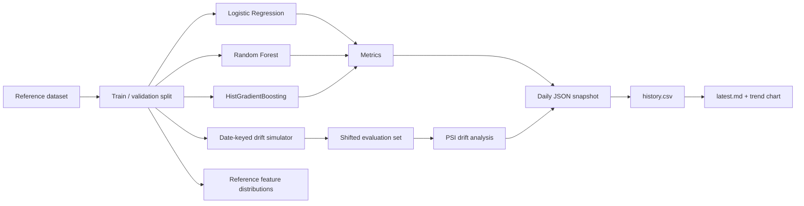

# DriftWatch ML

**Continuous model-drift observatory with an automated daily benchmark pipeline.**

DriftWatch ML is a compact MLOps-style project that tracks how a small model fleet behaves under controlled covariate shift. Every scheduled run trains the same candidate models on a stable reference distribution, generates a date-dependent drift scenario, evaluates predictive quality and calibration, measures feature-level Population Stability Index (PSI), updates a historical metrics table, regenerates a trend chart, and stores an auditable JSON experiment snapshot.

The project is intentionally designed so that automated commits contain **real experiment outputs**, not empty or timestamp-only changes.

## What it demonstrates

- Reproducible ML experiments with deterministic, date-keyed drift scenarios
- Multi-model benchmarking: Logistic Regression, Random Forest, HistGradientBoosting
- Drift monitoring with feature-level PSI
- Classification metrics: ROC-AUC, F1, balanced accuracy, log loss, Brier score
- Daily experiment snapshots in JSON
- Historical metrics in CSV + generated Markdown status report
- Automated trend visualization
- Pytest coverage for drift and reporting logic
- GitHub Actions CI plus a scheduled daily observatory run

## Architecture



## Repository layout

```text
.
├── .github/workflows/
│   ├── ci.yml
│   └── daily-observatory.yml
├── assets/
├── experiments/              # one JSON snapshot per day
├── reports/
│   ├── history.csv
│   ├── latest.md
│   └── metrics_trend.png
├── src/driftwatch/
│   ├── data.py
│   ├── drift.py
│   ├── metrics.py
│   ├── models.py
│   ├── reporting.py
│   └── run_daily.py
├── tests/
├── Makefile
├── pyproject.toml
└── requirements.txt
```

## Run locally

```bash
python -m venv .venv
# Windows: .venv\Scripts\activate
# macOS/Linux: source .venv/bin/activate
pip install -r requirements.txt
pip install -e .
python -m driftwatch.run_daily
```

Run for a specific experiment date:

```bash
python -m driftwatch.run_daily --date 2026-08-20
```

Then run tests:

```bash
pytest -q
```

## Daily automation

`.github/workflows/daily-observatory.yml` runs every day at **07:17 America/Toronto** and can also be run manually. It:

1. checks out the default branch;
2. installs dependencies;
3. runs the test suite;
4. executes the daily drift benchmark;
5. commits only if generated experiment/report files changed;
6. pushes the commit back to the default branch.

The workflow sets the commit author to a repository-configurable identity. For contribution attribution, set these **GitHub Actions repository variables**:

- `COMMIT_NAME` — your GitHub display name or username
- `COMMIT_EMAIL` — an email address associated with your GitHub account, or your GitHub-provided `noreply` address

If those variables are not set, the workflow falls back to the triggering GitHub actor and the modern ID-based `noreply` format.

> GitHub only credits qualifying commits to your contribution graph when the commit email is associated with your account and the commit lands on the repository's default branch (or `gh-pages`).

## Drift scenario

The source dataset is scikit-learn's Breast Cancer Wisconsin dataset. DriftWatch never changes labels. Instead, it creates a controlled covariate shift in the held-out evaluation set by combining:

- mean shift on a rotating subset of features;
- scale perturbation;
- Gaussian measurement noise;
- sparse feature masking.

The drift strength and affected features are deterministic for a given calendar date, making each daily experiment reproducible while still changing over time.

## Why this is more than a contribution filler

The repository produces a real longitudinal benchmark. After a few weeks, `reports/history.csv` becomes a useful dataset for studying performance degradation, model robustness, calibration, and the relationship between PSI and predictive metrics. You can extend it later with Evidently, MLflow, DVC, real production telemetry, or cloud deployment without redesigning the core pipeline.

## License

MIT
