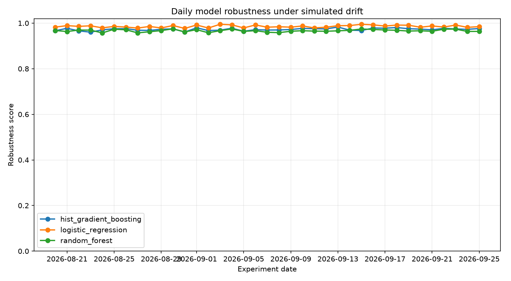
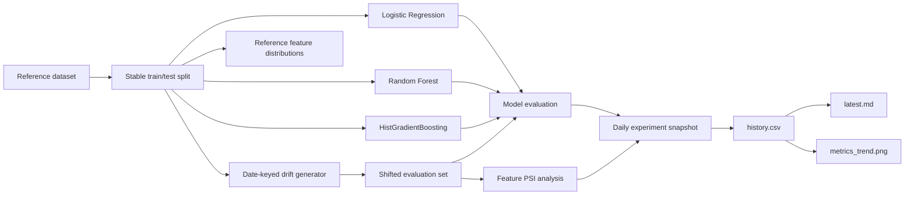

<div align="center">

# DriftWatch ML

### Continuous model-drift observatory for reproducible ML robustness experiments

[](https://github.com/Shobhit9985/driftwatch-ml/actions/workflows/ci.yml)
[](https://github.com/Shobhit9985/driftwatch-ml/actions/workflows/daily-observatory.yml)


**Daily benchmarking • model robustness • covariate shift • PSI monitoring • reproducible experiments**

[Latest Report](reports/latest.md) · [Experiment History](reports/history.csv) · [Model Card](MODEL_CARD.md) · [Daily Workflow](.github/workflows/daily-observatory.yml)

</div>

---

## Overview

**DriftWatch ML** is an automated MLOps-style observatory that measures how multiple machine-learning models respond to controlled data drift over time.

Every daily run starts from a stable reference dataset, creates a deterministic date-keyed covariate-shift scenario, evaluates a small model fleet, measures feature drift using **Population Stability Index (PSI)**, and records the resulting model-quality and calibration metrics.

Instead of producing a single static benchmark, the repository builds a **longitudinal experiment history** that can be used to study robustness degradation, model ranking changes, calibration behavior, and the relationship between input drift and predictive performance.

### Model fleet

| Model | Role in benchmark |
|---|---|
| Logistic Regression | Linear, well-calibrated baseline |
| Random Forest | Bagged nonlinear ensemble |
| HistGradientBoosting | Boosted nonlinear tree model |

### Metrics tracked

- ROC-AUC
- F1 score
- Balanced accuracy
- Log loss
- Brier score
- Composite robustness score
- Mean feature PSI
- Maximum feature PSI

---

## Results over time

The chart below is regenerated automatically by the daily observatory workflow. As new runs accumulate, it becomes a longitudinal view of model robustness under changing drift conditions.



The machine-readable history is stored in [`reports/history.csv`](reports/history.csv), while the most recent ranked benchmark is published in [`reports/latest.md`](reports/latest.md).

### Latest automated benchmark

The current report includes:

- the active drift strength and perturbation parameters;
- the affected feature subset;
- feature-level PSI values;
- ranked model performance;
- calibration metrics;
- mean and maximum observed PSI.

➡️ **[Open the latest generated report](reports/latest.md)**

---

## System architecture



---

## Daily experiment lifecycle

```text
Scheduled / manual GitHub Action
            │
            ▼
     Run test suite
            │
            ▼
   Build drift scenario
            │
            ▼
 Train + evaluate model fleet
            │
            ▼
 Compute PSI + ML metrics
            │
            ▼
 Write auditable JSON snapshot
            │
            ├──► experiments/YYYY-MM-DD.json
            ├──► reports/history.csv
            ├──► reports/latest.md
            └──► reports/metrics_trend.png
            │
            ▼
 Commit only when outputs changed
```

The pipeline is intentionally idempotent for a given date: rerunning the same experiment with unchanged inputs should not create another generated-results commit.

---

## Drift simulation

The benchmark uses scikit-learn's **Breast Cancer Wisconsin** dataset and applies controlled covariate shift only to the evaluation features. Labels are never modified.

Each date maps to a reproducible drift scenario composed of:

- **mean shift** on a rotating feature subset;
- **scale perturbation**;
- **Gaussian measurement noise**;
- **sparse feature masking**.

This provides changing daily conditions while preserving reproducibility for a specific experiment date.

---

## Reproducibility

DriftWatch is designed so that repeated runs of the same experiment date produce stable persisted outputs.

The pipeline uses:

- fixed dataset splitting;
- seeded model training;
- deterministic date-derived drift scenarios;
- controlled numerical threading in CI;
- normalized floating-point serialization;
- idempotent history updates keyed by date and model.

This makes the repository suitable for comparing model behavior across dates rather than accidentally measuring execution noise.

---

## Repository structure

```text
.
├── .github/
│   └── workflows/
│       ├── ci.yml
│       └── daily-observatory.yml
│
├── experiments/
│   └── YYYY-MM-DD.json       # auditable daily experiment snapshots
│
├── reports/
│   ├── history.csv           # longitudinal benchmark history
│   ├── latest.md             # latest ranked report
│   └── metrics_trend.png     # automatically regenerated trend chart
│
├── src/driftwatch/
│   ├── data.py               # stable dataset loading / split
│   ├── drift.py              # drift generation + PSI
│   ├── metrics.py            # evaluation metrics
│   ├── models.py             # candidate model fleet
│   ├── reporting.py          # reports and visualization
│   └── run_daily.py          # benchmark orchestration
│
├── tests/
├── MODEL_CARD.md
├── CONTRIBUTING.md
├── Makefile
├── pyproject.toml
└── requirements.txt
```

---

## Run locally

### 1. Create an environment

```bash
python -m venv .venv
```

Activate it:

```bash
# Windows
.venv\Scripts\activate

# macOS / Linux
source .venv/bin/activate
```

### 2. Install

```bash
python -m pip install --upgrade pip
pip install -r requirements.txt
pip install -e .
```

### 3. Run the benchmark

```bash
python -m driftwatch.run_daily
```

Or reproduce a specific experiment date:

```bash
python -m driftwatch.run_daily --date 2026-08-20
```

### 4. Run tests

```bash
pytest -q
```

---

## Automation

The repository contains two GitHub Actions workflows.

### Continuous integration

[`ci.yml`](.github/workflows/ci.yml) validates pushes and pull requests by installing the package and running the test suite.

### Daily ML Drift Observatory

[`daily-observatory.yml`](.github/workflows/daily-observatory.yml) runs every day at **07:17 America/Toronto** and can also be triggered manually.

The workflow:

1. checks out the default branch;
2. configures Python;
3. installs dependencies;
4. runs the test suite;
5. executes the date-keyed benchmark;
6. regenerates experiment and report outputs;
7. checks whether anything materially changed;
8. commits and pushes only changed generated results.

---

## Experiment artifacts

Each run produces a structured snapshot such as:

```text
experiments/2026-08-20.json
```

A snapshot records:

```text
experiment date
├── dataset metadata
├── drift scenario
├── drift summary
├── feature-level PSI
└── model results
    ├── ROC-AUC
    ├── F1
    ├── balanced accuracy
    ├── log loss
    ├── Brier score
    └── robustness score
```

This creates an auditable record of exactly what the benchmark observed on each date.

---

## Possible extensions

The current architecture can be extended without replacing the core experiment pipeline. Natural next steps include:

- Evidently or custom drift dashboards;
- MLflow experiment tracking;
- DVC-backed dataset/version management;
- concept-drift detection in addition to covariate drift;
- statistical drift significance tests;
- adaptive thresholding and alert generation;
- model champion/challenger promotion logic;
- real production telemetry ingestion;
- cloud-hosted monitoring and scheduled retraining.

---

## Model documentation

For assumptions, intended use, limitations, and model details, see [`MODEL_CARD.md`](MODEL_CARD.md).

## License

MIT
